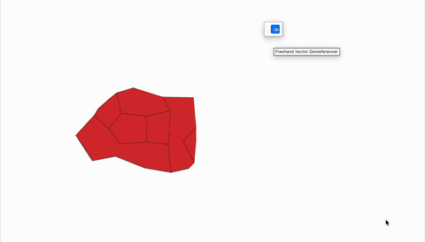
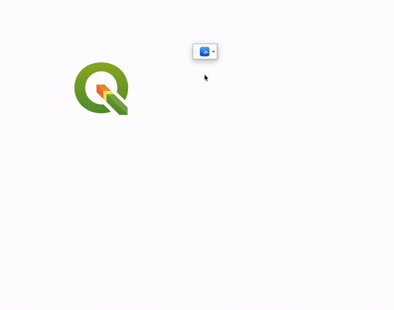

# Freehand Georeferencer

An intuitive QGIS georeferencing tool for both vector and raster layers.

Add control points (GCPs) with the mouse only: grab a point and release it at the correct destination position. The transform is previewed live in the map canvas, and the result can then be applied to the target layer.

This plugin is the successor to the older Freehand Vector Georeferencer workflow and extends it to raster georeferencing while keeping the direct “grab and move” interaction model.

## Demo

The animation above plays automatically. For the full-quality version, see the [demo video (MP4)](media/demo.mp4).

The animation above plays automatically. For the full-quality version, see the [demo video (MP4)](media/demo2.mp4).

## Features

- Vector target layers
  - Press an old node and release at the new position.
  - Sources snap to vertices of any visible vector layer, including the target layer itself.
  - Scope can be single feature, selected features only, or the whole layer.
  - Apply can create a new memory layer, add to the current layer, or edit the current layer in place (undoable).

- Raster target layers
  - Press a recognizable point on the image and release it at the correct map position.
  - Source picking is free-point based because a raster has no vertices.
  - The raster preview is shown as a live image overlay in the map canvas.
  - Apply writes a new georeferenced raster as a VRT with an updated geotransform, without resampling and without loss of the original pixel information.
  - Web/tile rasters such as GSI maps, XYZ, WMS, and WMTS are excluded from the target list.
  - When a raster has no GCPs yet, the primary button can add a first GCP from the raster center to the map canvas center, reducing long-distance panning when the raster is far from the map origin.

- Transform types
  - Helmert (fixed scale or variable scale)
  - Affine

- Quality feedback
  - Per-GCP X/Y error
  - Overall RMS, standard deviation, and scale factor
  - Residuals shown in a green-to-red color ramp
  - Sortable GCP table
  - Live drag / toggle editing of GCPs

- Data exchange
  - Save/load GCP lists as CSV

## Important: same-CRS workflow

This plugin applies a plain 2D affine transform and does not reproject data. Keep the layer CRS and project CRS identical before georeferencing. A warning is shown automatically if they differ.

The reason is simple:

- GCP source coordinates are read in the layer CRS
- GCP destination coordinates are read in the map/project CRS
- The transform is a planar Helmert/Affine map, not a geodetic reprojection
- The workflow is intended for local alignment, not coordinate-system conversion

## Installation

Install from the QGIS Plugin Manager by searching for “Freehand Georeferencer”, or copy this folder manually into your QGIS `python/plugins` directory.

## Packaging for plugins.qgis.org

The plugin id is `freehand_vector_georeferencer` (kept so existing users can update in place). When building the upload ZIP, the top-level folder inside the ZIP must be named `freehand_vector_georeferencer`.

## Acknowledgment

The interactive “grab and move” UI is inspired by the Freehand Raster Georeferencer plugin by Guilhem Vellut.

## License

This plugin is distributed under the GNU General Public License v3.0. See [LICENSE](LICENSE).

It is derived from work originally licensed under GPL v2 or later, and is distributed under GPL v3.

## Notes

- Minimum QGIS version: 4.0
- Plugin category: Plugins
- Project homepage: https://note.com/sandatakeru/n/n654543a913d8
- Repository: https://github.com/SandaTakeru/Freehand-Georeferencer
- Issue tracker: https://github.com/SandaTakeru/Freehand-Georeferencer
